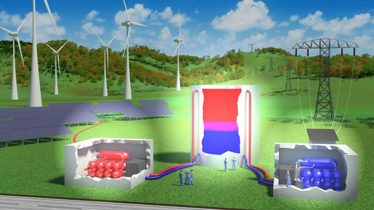

# Introduction

Carnot batteries are a quickly developing group of technologies for medium and long duration electricity storage. It covers a large range of concepts which share processes of a conversion of power to heat, thermal energy storage (i.e., storing thermal exergy) and in times of need conversion of the heat back to (electric) power. Even though these systems were already proposed in the 19th century, it is only in the recent years that this field experiences a rapid development, which is associated mostly with the increasing penetration of intermittent cheap renewables in power grids and the requirement of electricity storage in unprecedented capacities.

Compared to the more established storage options, such as pumped hydro and electrochemical batteries, the efficiency is generally much lower, but the low cost of thermal energy storage in large scale and long lifespans comparable with thermal power plants make this technology especially feasible for storing surpluses of cheap renewable electricity over typically dozens of hours and up to days. Within the increasingly extensive scientific research of the Carnot Battery technologies, commercial development plays the major role in technology implementation.

The share of renewable generation in electricity production is ever increasing with the feasibility of a 100% renewable supply supported by multiple studies. The intermittent nature of these sources puts increasing requirements on electricity storage and system flexibility. Lithium batteries are a well-established technology within this field, provide high efficiency (95%, though in real operation, auxiliaries and performance decay by wearing and ageing can notably decrease this value) and relatively low cost per unit power (€/kW). For grid scale medium and long duration applications, however, they are economically well fitted to no more than several hours of capacity due to the high cost per unit capacity (€/kWh). Investigation of a hypothetical 100% of renewable scenario for the UK has found, that, apart from the required installation of certain over-generation, it is the medium duration energy storage in the range of multiple hours to days, through which the majority of the stored electricity needs to flow. The lifetime of electrochemical batteries, typically below 10 years, furthermore stresses the need to search for other solutions. Currently, pumped hydro energy storage (PHES) largely dominates the installed storage capacity in comparison to other solutions.

Carnot batteries (CB) comprise a set of multiple technologies which have a common underlying principle of converting the electricity to thermal exergy, storing it in thermal energy storage (TES) systems, and in a time of need converting the heat back to electricity. Based on this principle, alternative terms are also used as power to heat to power (P2H2P) or electric thermal (or electro-thermal) energy (electricity) storage (ETES).

# Working principle

A general principle of the CB is illustrated below.

    

Carnot Batteries use surplus electricity as an input of a power to heat (P2H) system to create a temperature gradient (thermal exergy). It can have a form of hot and cold storage systems, or just one of those (hot or cold) with the temperature gradient defined against the environment. During the discharging process, the thermal exergy is converted back to work (electricity) by heat to power (H2P) system, in principle a heat engine. Various concepts of CB can be illustrated regarding the P2H and H2P conversion processes and thermal integration of the heat source.

    

CB concepts regarding thermal integration of heat sources and conversion systems. ( **a** ) direct heat to power conversion, ( **b** ) reversible thermodynamic cycle, ( **c** ) with heat source integration and hot storage or ( **d** ) cold storage.

# My involvement

Together with my colleagues, esp. [Václav N](https://www.linkedin.com/in/v%C3%A1clav-novotn%C3%BD-04a2b26b/)., we are modelling systems for power to heat and heat to power from thermodynamic perspective. We represent the Czech Republic in the [IEA Energy Storage Technology Collaboration Programme](https://iea-es.org/) as country delegates and actively participate in [Task36 Carnot Batteries](https://www.eces-a36.org/) within the TCP. Current step is investigating and evaluating the proficiency of early-stage pilot plants Carnot Batteries in Czech Republic, a district heating CHP plants.

For more information on this subject, you are welcome to read our [co-authored open-access paper](https://www.mdpi.com/1996-1073/15/2/647).

(header img. source DLR, rest authors' collective)
